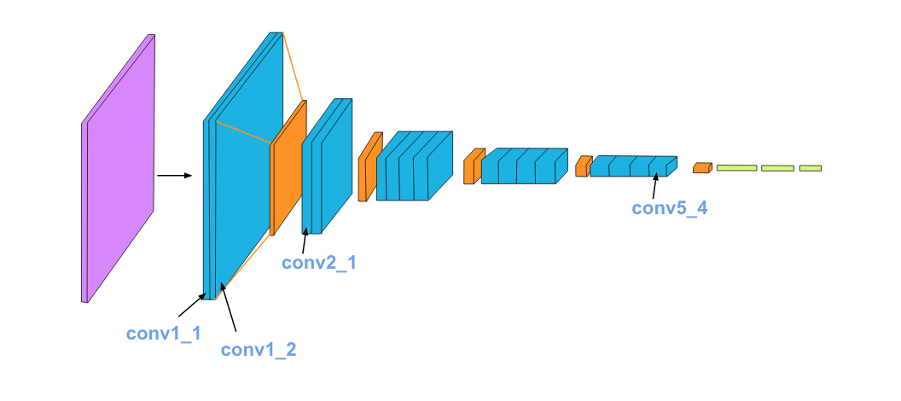
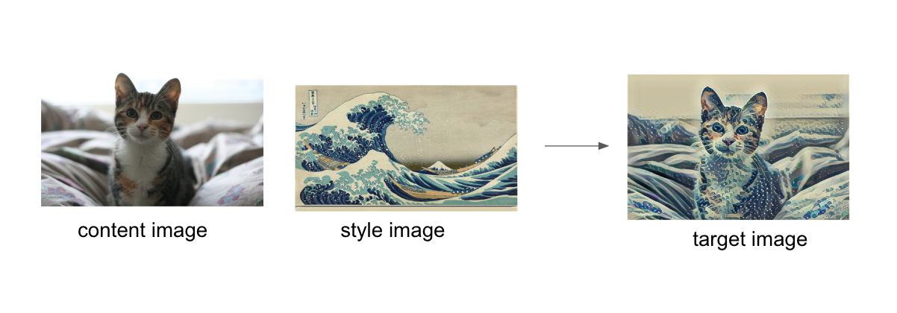

# Implementation of Image Style Transfer Using Convolutional Neural Networks using Pytorch

## Style Transfer with Deep Neural Networks

This notebook *recreates* a style transfer method that is outlined in the paper, [Image Style Transfer Using Convolutional Neural Networks, by Gatys](https://www.cv-foundation.org/openaccess/content_cvpr_2016/papers/Gatys_Image_Style_Transfer_CVPR_2016_paper.pdf) in PyTorch.

In this paper, style transfer uses the features found in the 19-layer VGG Network, which is comprised of a series of convolutional and pooling layers, and a few fully-connected layers. In the image below, the convolutional layers are named by stack and their order in the stack. Conv1_1 is the first convolutional layer that an image is passed through, in the first stack. Conv2_1 is the first convolutional layer in the *second* stack. The deepest convolutional layer in the network is conv5_4.

### Separating Style and Content

Style transfer relies on separating the content and style of an image. Given one content image and one style image, we aim to create a new, _target_ image which should contain our desired content and style components:

An example is shown below, where the content image is of a cat, and the style image is of [Hokusai's Great Wave](https://en.wikipedia.org/wiki/The_Great_Wave_off_Kanagawa). The generated target image still contains the cat but is stylized with the waves, blue and beige colors, and block print textures of the style image!

This notebook will use a pre-trained **VGG19 Net** to extract content or style features from a passed in image.

### Results from the Notebook

### Results from the Paper

<h2 align= "left"><b>Project Maintainer(s)</b></h2>

<table>
<tr align="center">
  
  <td>
  
Suvodeep Sinha

</td>
